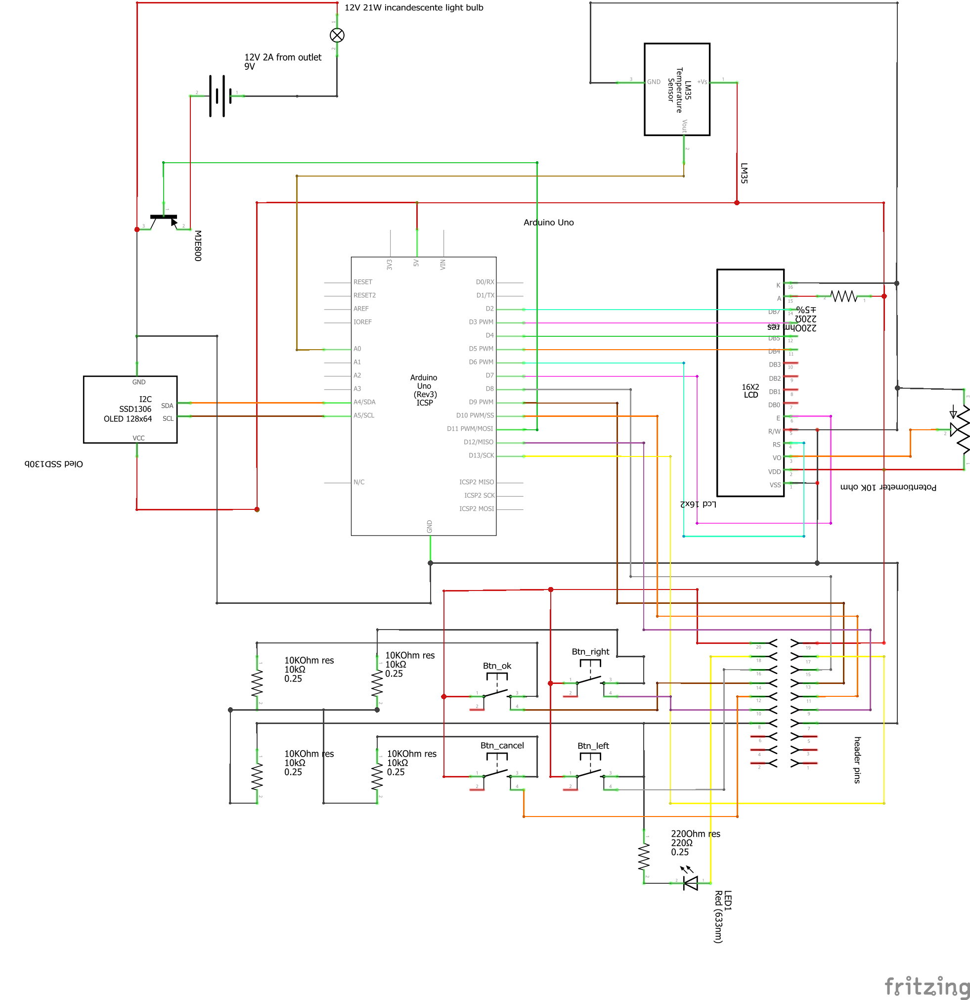
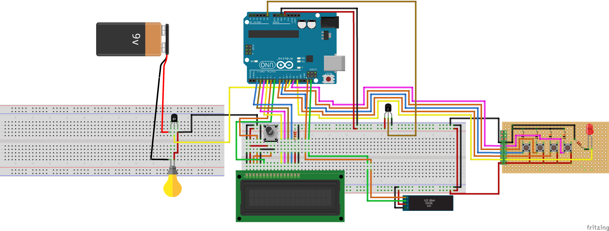
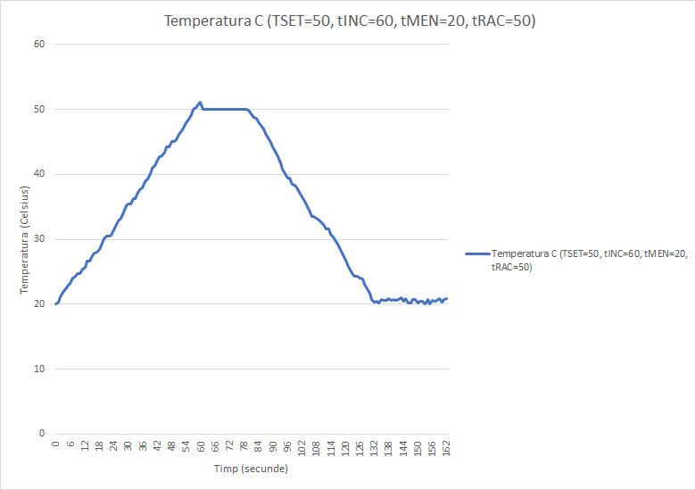

# Automatic Temperature Regulation System

## Project Description
This project is developed as part of a university assignment to create an automatic temperature regulation system for the heat emitted by an incandescent bulb. The system is built using an ATMega328P microcontroller and features a menu displayed on a 2x16 LCD. An OLED display is also used to show real-time statuses.

The core of the system is a PID controller that ensures precise temperature regulation. The user can configure the following parameters via buttons:
- **T_set**: Target temperature
- **T_inc**: Time to reach the target temperature
- **T_men**: Time to maintain the target temperature
- **T_rac**: Time to cool down to the initial temperature
- **Kp**: Proportional coefficient
- **Ki**: Integral coefficient
- **Kd**: Derivative coefficient

The system operates in three cycles:
1. **Heating**: The rate of temperature increase is calculated per second, adjusting an intermediate temperature (`t_intermediar`) from the initial temperature.
2. **Maintaining**: The intermediate temperature remains constant.
3. **Cooling**: The rate of temperature decrease is calculated per second, adjusting `t_intermediar` until it reaches the initial temperature.

The PID function is called every second to ensure smooth and accurate regulation.

---

## Components Used
- **1x Arduino UNO**
- **1x Potentiometer (10K Ohm)**
- **4x Pushbuttons**
- **4x Resistors (10K Ohm)**
- **2x Resistors (220 Ohm)**
- **1x 16x2 LCD**
- **1x 1.3-inch OLED display (I2C)**
- **1x LM35 Temperature Sensor**
- **1x MJE800 Transistor**
- **3x Breadboards**
- **1x 12V 21W Incandescent Bulb**
- **1x Transformer (220V 50Hz to 12V 2A)**
  - *(In the schematic, a 9V battery is used as a placeholder)*
- **A lot of wires**

---

## System Features
### LCD Menu
The 16x2 LCD is used for navigating the system's menu, where the user can set:
- **T_set**: Target temperature
- **T_inc**: Heating time
- **T_men**: Maintaining time
- **T_rac**: Cooling time
- **Kp, Ki, Kd**: PID coefficients

### OLED Display
The 1.3-inch OLED displays real-time system statuses:
- Current cycle
- Target temperature
- Real-time temperature
- Remaining time

---

## PID Coefficients
To achieve appropriate system behavior in reality, the following coefficients were used:
- **Kp = 2**
- **Ki = 2.3**
- **Kd = 0.002**

The PID function is invoked every second to ensure precise control.

---

## System Cycles
1. **Heating Cycle**:
   - Calculates the required temperature increase per second.
   - Updates `t_intermediar` from the initial temperature to the target temperature.

2. **Maintaining Cycle**:
   - Keeps `t_intermediar` constant at the target temperature.

3. **Cooling Cycle**:
   - Calculates the required temperature decrease per second.
   - Adjusts `t_intermediar` back to the initial temperature.

---

## Code Architecture
The project is implemented using **Object-Oriented Programming (OOP)** principles to ensure modularity and maintainability.

---

## Schematic

---

## PID Graph

---

## License
This project is licensed under the [MIT License](LICENSE).

## Credits
- **Author**: Felix-Marian STOENOIU
- **Email**: Stoenoiu.Felix1@gmail.com
- **GitHub**: [My GitHub profile](https://github.com/FelixMarian)
